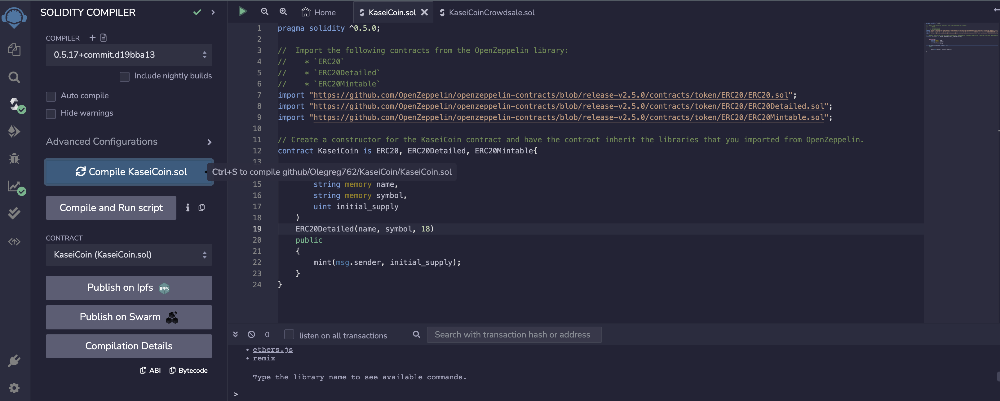
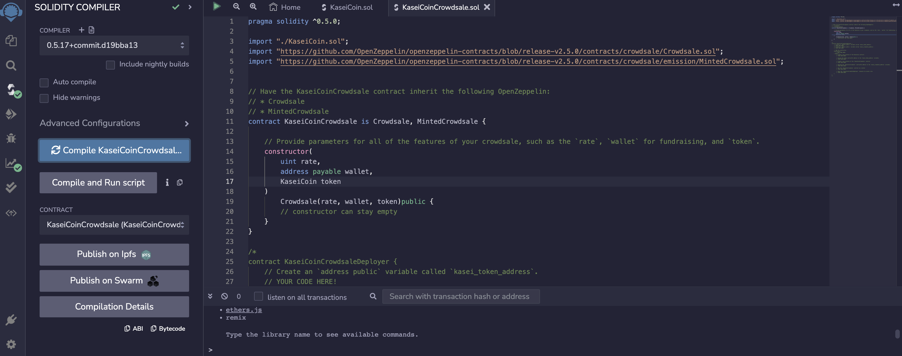
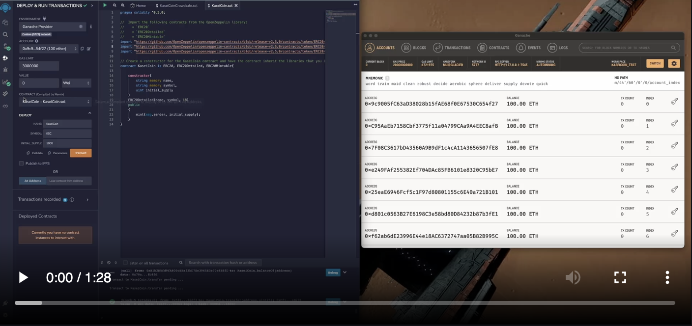

# KaseiCoin

Supporting the efforts to colonize Mars and establish it as an independent nation seperate from Earth. 
I have developed a cryptocurrency for Newly created Mars Congressional Republic(MCR) called KaseiCoin. 
Those who wish to become citizens of MCR can trade their Earth centric cryptocurrencies for KaseiCoin using the smart contract. 

## KaseiCoin Contract Compilation

## Compilation of KaseiCoin Crowd Sale Part 1

## Compilation of KaseiCoin Crowd Sale Part 2

## Link to Video Showcasing Operation of KaseiCoin Contract

